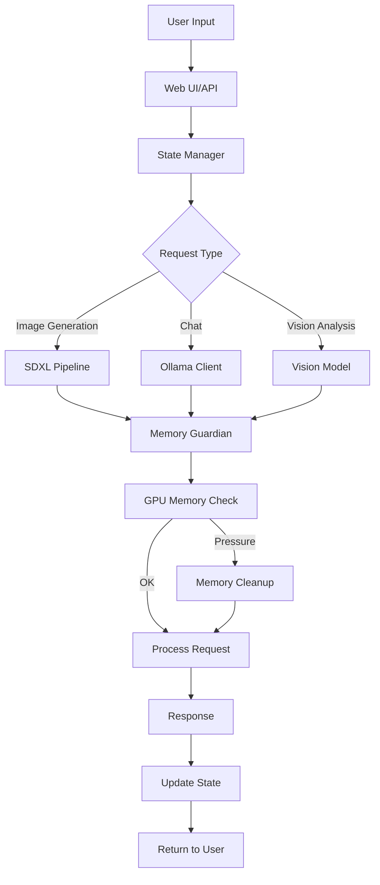

# 🚀 Illustrious AI Studio - Comprehensive Development Guide

> **Ready to Contribute?** This guide will get you from zero to productive contributor in 30 minutes.

## 📋 Table of Contents

- [🎯 Project Overview](#-project-overview)
- [⚡ Quick Setup](#-quick-setup)
- [🏗️ Architecture Deep Dive](#️-architecture-deep-dive)
- [🔧 Development Workflow](#-development-workflow)
- [🧪 Testing & Quality Assurance](#-testing--quality-assurance)
- [📦 Deployment & Production](#-deployment--production)
- [🤝 Contributing Guidelines](#-contributing-guidelines)
- [🆘 Troubleshooting](#-troubleshooting)

---

## 🎯 Project Overview

### What is Illustrious AI Studio?

A **powerful local AI application** that combines:

- 🎨 **SDXL Image Generation** - High-quality image generation with Stable Diffusion XL
- 🧠 **Ollama LLM Integration** - Chat with local language models
- 👁️ **Vision Analysis** - Image understanding and Q&A capabilities
- 🛡️ **Advanced Memory Management** - Smart GPU memory handling for stability
- 🌐 **Dual Interface** - Web UI (Gradio) + REST API (FastAPI)

### Tech Stack at a Glance

| Component | Technology | Purpose |
|-----------|------------|---------|
| **Backend** | Python 3.10+ | Main application logic |
| **AI Models** | PyTorch, Diffusers, Transformers | SDXL image generation |
| **LLM Integration** | Ollama | Local language model server |
| **Web UI** | Gradio | Interactive web interface |
| **API Server** | FastAPI + Uvicorn | RESTful API endpoints |
| **Memory Management** | Custom Guardian System | GPU OOM prevention |
| **Configuration** | YAML + Pydantic | Type-safe configuration |
| **Testing** | Pytest | Comprehensive test coverage |

### Key Features & Capabilities

- ✅ **Memory Guardian System** - Prevents GPU out-of-memory crashes
- ✅ **Model Hot-Swapping** - Switch between models without restart
- ✅ **Prompt Template System** - Save and reuse prompt templates
- ✅ **Gallery Management** - Organize and search generated images
- ✅ **MCP Server Integration** - Model Context Protocol for external tools
- ✅ **Multi-Interface Support** - CLI, Web UI, and API access

---

## ⚡ Quick Setup

### Prerequisites

```bash
# System Requirements
- Python 3.10 or higher
- CUDA-compatible GPU (recommended: 16GB+ VRAM)
- 32GB+ RAM (16GB minimum)
- 50GB+ free disk space

# Required Software
- Git
- Python/pip or Conda
- Ollama (for LLM functionality)
```

### 1. Clone & Setup Environment

```bash
# Clone the repository
git clone <repository-url>
cd illustrious-ai-studio

# Create virtual environment
conda create -n ai-studio python=3.10
conda activate ai-studio

# Or using venv
python -m venv venv
source venv/bin/activate  # Linux/Mac
# venv\Scripts\activate   # Windows
```

### 2. Install Dependencies

```bash
# Install PyTorch with CUDA support (if you have NVIDIA GPU)
pip install torch torchvision torchaudio --index-url https://download.pytorch.org/whl/cu121

# Install all other requirements
pip install -r requirements.txt

# Install development dependencies
pip install -r requirements-test.txt
```

### 3. Setup Ollama (LLM Backend)

```bash
# Install Ollama (Linux/Mac)
curl -fsSL https://ollama.ai/install.sh | sh

# Start Ollama service
ollama serve

# In another terminal, pull a model
ollama pull llama3.2:3b
ollama pull llava:7b  # For vision capabilities
```

### 4. Initial Configuration

```bash
# Run the automated setup (downloads models, creates config)
python setup.py

# Verify everything is working
python verify_setup.py
```

### 5. Launch the Application

```bash
# Quick start (fastest - loads models on demand)
python main.py --quick-start --open-browser

# Or use the interactive launcher
python launch.py
```

🎉 **You should now see the web interface at `http://localhost:7860`**

---

## 🏗️ Architecture Deep Dive

### Project Structure

```
illustrious-ai-studio/
├── 🎯 main.py                 # Application entry point
├── 🔌 app.py                  # FastAPI compatibility wrapper
├── 🚀 launch.py               # Interactive launcher
├── ⚙️ config.yaml             # Main configuration file
├── 📁 core/                   # Core functionality
│   ├── config.py              # Configuration management
│   ├── state.py               # Application state container
│   ├── sdxl.py                # SDXL image generation
│   ├── ollama.py              # Ollama LLM integration
│   ├── memory.py              # Memory management utilities
│   ├── memory_guardian.py     # Real-time memory monitoring
│   ├── prompt_templates.py    # Template system
│   └── gallery_filters.py     # Image gallery management
├── 🖥️ ui/                     # User interface
│   ├── web.py                 # Gradio web interface
│   └── custom.css             # UI styling
├── 🌐 server/                 # API server
│   └── api.py                 # FastAPI endpoints
├── 🧪 tests/                  # Test suite
├── 📊 projects/               # User project workspaces
├── 🤖 models/                 # AI model files
├── 🔌 mcp_servers/            # Model Context Protocol servers
└── 📚 examples/               # Documentation and examples
```

### Core Components Breakdown

#### 1. **Configuration System** (`core/config.py`)

```python
class SDXLConfig(BaseModel):
    """Type-safe configuration with validation"""
    
    # Model paths and settings
    model_path: str = "models/Illustrious.safetensors"
    scheduler: str = "DPMSolverMultistepScheduler"
    
    # Generation parameters
    width: int = 1024
    height: int = 1024
    num_inference_steps: int = 20
    
    # Memory management
    enable_memory_efficient_attention: bool = True
    enable_cpu_offload: bool = False
```

**Key Features:**

- Environment variable overrides
- YAML file-based configuration
- Runtime configuration updates
- Type validation with Pydantic

#### 2. **State Management** (`core/state.py`)

```python
class AppState:
    """Centralized application state"""
    
    def __init__(self):
        self.sdxl_model = None
        self.ollama_client = None
        self.memory_guardian = None
        self.generation_history = []
        self.chat_history = []
        self._lock = threading.Lock()
```

**Thread-safe state management** for:

- Model instances
- Generation history
- Chat conversations
- Memory statistics

#### 3. **Memory Guardian System** (`core/memory_guardian.py`)

```python
class MemoryGuardian:
    """Real-time GPU memory monitoring and management"""
    
    def __init__(self, threshold_mb: int = 2048):
        self.threshold_mb = threshold_mb
        self.monitoring_active = False
        
    def start_monitoring(self):
        """Start background memory monitoring thread"""
        
    def handle_memory_pressure(self):
        """Emergency memory cleanup procedures"""
```

**Prevents OOM crashes** through:

- Real-time GPU memory monitoring
- Automatic model unloading under pressure
- Graceful degradation of generation parameters
- Emergency cleanup procedures

#### 4. **SDXL Integration** (`core/sdxl.py`)

```python
def init_sdxl(config: SDXLConfig) -> StableDiffusionXLPipeline:
    """Initialize SDXL model with optimizations"""
    
    pipeline = StableDiffusionXLPipeline.from_single_file(
        config.model_path,
        torch_dtype=torch.float16,
        use_safetensors=True
    )
    
    # Apply memory optimizations
    if config.enable_memory_efficient_attention:
        pipeline.enable_attention_slicing()
        pipeline.enable_model_cpu_offload()
    
    return pipeline
```

**Features:**

- Multiple model support
- Memory-efficient loading
- Dynamic parameter adjustment
- Gallery management
- Progress tracking

#### 5. **Ollama Integration** (`core/ollama.py`)

```python
class OllamaClient:
    """Ollama LLM client with enhanced capabilities"""
    
    def chat(self, messages: List[Dict], model: str = "llama3.2:3b"):
        """Send chat messages to Ollama"""
        
    def generate_prompt(self, description: str) -> str:
        """Generate image prompts from descriptions"""
        
    def analyze_image(self, image_path: str, question: str) -> str:
        """Vision model image analysis"""
```

**Capabilities:**

- Multi-model chat support
- Vision model integration
- Prompt enhancement
- Conversation memory
- Streaming responses

### Data Flow Architecture



---

## 🔧 Development Workflow

### Setting Up Your Development Environment

```bash
# 1. Fork and clone the repo
git clone <your-fork-url>
cd illustrious-ai-studio

# 2. Create development branch
git checkout -b feature/your-feature-name

# 3. Install in development mode
pip install -e .

# 4. Install pre-commit hooks
pip install pre-commit
pre-commit install
```

### Available Development Tasks

The project includes VS Code tasks for common development operations:

```bash
# Quick development server with hot reload
python main.py --lazy-load --log-level DEBUG --optimize-memory --open-browser

# Or use VS Code task: "🔧 Start AI Studio (Development)"
```

**Available VS Code Tasks:**

- `🚀 Start AI Studio (Quick)` - Fast startup, load models on demand
- `⏳ Start AI Studio (Lazy Load)` - UI first, then models
- `🔧 Start AI Studio (Development)` - Full debug mode
- `🌐 Start FastAPI Server` - API server only
- `🧪 Run All Tests` - Complete test suite
- `🔍 Run Current Test File` - Test current file
- `🛠️ Install Dependencies` - Pip install requirements
- `🧹 Clean Python Cache` - Remove **pycache** directories

### Development Modes

#### 1. **Quick Start Mode** (Fastest Development)

```bash
python main.py --quick-start --open-browser
```

- Starts UI immediately
- Models load on first use
- Best for UI development

#### 2. **Lazy Load Mode** (Balanced)

```bash
python main.py --lazy-load --open-browser
```

- UI starts first
- Models load in background
- Best for general development

#### 3. **Development Mode** (Full Debug)

```bash
python main.py --lazy-load --log-level DEBUG --open-browser
```

- Full logging enabled
- Memory optimization active
- Best for debugging

### Code Style and Standards

```python
# Use type hints everywhere
def generate_image(prompt: str, width: int = 1024) -> Optional[Image.Image]:
    """Generate image with SDXL model."""
    
# Follow PEP 8 naming conventions
class MemoryGuardian:
    def __init__(self, threshold_mb: int = 2048):
        self.threshold_mb = threshold_mb
        
# Use docstrings for all public functions
def init_sdxl(config: SDXLConfig) -> StableDiffusionXLPipeline:
    """
    Initialize SDXL model with configuration.
    
    Args:
        config: SDXL configuration object
        
    Returns:
        Configured SDXL pipeline
        
    Raises:
        ModelLoadError: If model fails to load
    """
```

### Linting & Formatting

The project uses **pre-commit** to run [Black](https://github.com/psf/black) and
[Flake8](https://flake8.pycqa.org) on all commits. Hooks are installed during
the [development environment setup](#setting-up-your-development-environment).

```bash
# Manually run all checks
pre-commit run --all-files
```

These checks also run automatically in CI. Ensure your changes pass locally
before opening a pull request.

### Logging and Debugging

```python
import logging

# Use structured logging
logger = logging.getLogger(__name__)

def generate_image(prompt: str) -> Image.Image:
    logger.info(f"Starting image generation: {prompt[:50]}...")
    
    try:
        # Generation logic
        result = pipeline(prompt)
        logger.info("Image generation completed successfully")
        return result
        
    except Exception as e:
        logger.error(f"Image generation failed: {e}")
        raise
```

**Log Levels:**

- `DEBUG` - Detailed development info
- `INFO` - General operational messages
- `WARNING` - Important but non-critical issues
- `ERROR` - Error conditions that need attention

### Memory Management Best Practices

```python
# Always check memory before heavy operations
from core.memory import get_gpu_memory_usage, clear_gpu_memory

def generate_large_batch(prompts: List[str]) -> List[Image.Image]:
    memory_usage = get_gpu_memory_usage()
    if memory_usage > 0.8:  # 80% threshold
        logger.warning("High memory usage, clearing cache")
        clear_gpu_memory()
    
    # Proceed with generation
```

---

## 🧪 Testing & Quality Assurance

### Test Structure

```
tests/
├── conftest.py                      # Pytest configuration and fixtures
├── test_config_and_init.py          # Configuration system tests
├── test_memory_guardian_lifecycle.py # Memory management tests
├── test_api_endpoints.py            # API endpoint tests
├── test_generate_image.py           # Image generation tests
├── test_chat_history_persistence.py # Chat functionality tests
├── test_model_switching.py          # Model loading/unloading tests
└── test_full_functionality.py       # Integration tests
```

### Running Tests

```bash
# Run all tests
python -m pytest tests/ -v

# Run specific test file
python -m pytest tests/test_memory_guardian_lifecycle.py -v

# Run with coverage
python -m pytest tests/ --cov=core --cov-report=html

# Run tests matching pattern
python -m pytest -k "memory" -v
```

### Writing Tests

```python
import pytest
from core.memory_guardian import MemoryGuardian

class TestMemoryGuardian:
    """Test suite for memory guardian functionality."""
    
    @pytest.fixture
    def guardian(self):
        """Create a memory guardian instance for testing."""
        return MemoryGuardian(threshold_mb=1024)
    
    def test_memory_monitoring_start_stop(self, guardian):
        """Test that memory monitoring can be started and stopped."""
        assert not guardian.monitoring_active
        
        guardian.start_monitoring()
        assert guardian.monitoring_active
        
        guardian.stop_monitoring()
        assert not guardian.monitoring_active
    
    @pytest.mark.integration
    def test_memory_pressure_handling(self, guardian):
        """Test memory pressure handling (integration test)."""
        # This would test actual memory pressure scenarios
        pass
```

### Test Categories

- **Unit Tests** - Test individual functions and classes
- **Integration Tests** - Test component interactions
- **Memory Tests** - Test memory management and leaks
- **API Tests** - Test REST API endpoints
- **UI Tests** - Test web interface functionality

### Continuous Integration

```yaml
# .github/workflows/test.yml (example)
name: Tests
on: [push, pull_request]

jobs:
  test:
    runs-on: ubuntu-latest
    steps:
      - uses: actions/checkout@v3
      - name: Set up Python
        uses: actions/setup-python@v4
        with:
          python-version: 3.10
      - name: Install dependencies
        run: |
          pip install -r requirements-test.txt
      - name: Run tests
        run: pytest tests/ -v
```

---

## 📦 Deployment & Production

### Production Configuration

```yaml
# config.yaml - Production settings
production:
  enable_memory_efficient_attention: true
  enable_cpu_offload: false
  log_level: "INFO"
  max_concurrent_requests: 4
  memory_threshold_mb: 2048
  
security:
  enable_auth: true
  allowed_origins: ["https://yourdomain.com"]
  rate_limit_requests_per_minute: 60
```

### Docker Deployment

```dockerfile
# Dockerfile
FROM nvidia/cuda:11.8-devel-ubuntu22.04

# Install Python and dependencies
RUN apt-get update && apt-get install -y python3.10 python3-pip
COPY requirements.txt .
RUN pip install -r requirements.txt

# Copy application
COPY . /app
WORKDIR /app

# Set environment variables
ENV MODELS_DIR=/models
ENV LOG_LEVEL=INFO

# Expose ports
EXPOSE 7860 8000

# Start application
CMD ["python", "main.py", "--lazy-load"]
```

### Performance Tuning

```python
# Production optimizations
config = SDXLConfig(
    # Memory optimizations
    enable_memory_efficient_attention=True,
    enable_cpu_offload=False,  # Keep models on GPU for speed
    
    # Generation optimizations
    num_inference_steps=20,  # Balance quality vs speed
    scheduler="DPMSolverMultistepScheduler",  # Fast scheduler
    
    # Batch processing
    max_batch_size=4,
    enable_batch_processing=True
)
```

### Monitoring and Observability

```python
# Add monitoring endpoints
@app.get("/health")
def health_check():
    return {
        "status": "healthy",
        "gpu_memory_usage": get_gpu_memory_usage(),
        "models_loaded": len(app_state.loaded_models),
        "uptime": get_uptime()
    }

@app.get("/metrics")
def metrics():
    return {
        "generations_count": len(app_state.generation_history),
        "average_generation_time": calculate_avg_generation_time(),
        "memory_usage_history": get_memory_usage_history()
    }
```

---

## 🤝 Contributing Guidelines

### Contribution Process

1. **Fork** the repository
2. **Create** a feature branch: `git checkout -b feature/amazing-feature`
3. **Develop** your changes with tests
4. **Test** thoroughly: `python -m pytest tests/ -v`
5. **Document** your changes
6. **Submit** a pull request

### Pull Request Template

```markdown
## Description
Brief description of what this PR does.

## Type of Change
- [ ] Bug fix
- [ ] New feature
- [ ] Performance improvement
- [ ] Documentation update
- [ ] Refactoring

## Testing
- [ ] Unit tests pass
- [ ] Integration tests pass
- [ ] Manual testing completed

## Checklist
- [ ] Code follows style guidelines
- [ ] Self-review completed
- [ ] Documentation updated
- [ ] No breaking changes (or documented)
```

### Coding Standards

```python
# 1. Use type hints
def process_image(image: Image.Image, quality: int = 95) -> bytes:
    """Process image and return compressed bytes."""
    
# 2. Handle errors gracefully
try:
    result = risky_operation()
except SpecificException as e:
    logger.error(f"Operation failed: {e}")
    return default_value
    
# 3. Use context managers for resources
with torch.no_grad():
    output = model(input_tensor)
    
# 4. Document complex logic
def complex_algorithm(data: List[int]) -> int:
    """
    Implements the XYZ algorithm for data processing.
    
    The algorithm works by:
    1. Sorting the input data
    2. Applying transformation X
    3. Computing the result using formula Y
    """
```

### Review Criteria

**Code Quality:**

- ✅ Type hints used appropriately
- ✅ Error handling implemented
- ✅ No obvious performance issues
- ✅ Code is readable and maintainable

**Testing:**

- ✅ Unit tests for new functionality
- ✅ Integration tests if applicable
- ✅ No regression in existing tests

**Documentation:**

- ✅ Docstrings for public functions
- ✅ README updated if needed
- ✅ Comments for complex logic

---

## 🆘 Troubleshooting

### Common Development Issues

#### 1. **GPU Out of Memory**

```python
# Solution: Enable memory optimizations
config = SDXLConfig(
    enable_memory_efficient_attention=True,
    enable_cpu_offload=True,
    reduce_memory_usage=True
)

# Or use memory guardian
from core.memory_guardian import start_memory_guardian
start_memory_guardian(threshold_mb=1024)
```

#### 2. **Model Loading Failures**

```bash
# Check model files exist
ls -la models/

# Verify model integrity
python -c "
from safetensors import safe_open
with safe_open('models/Illustrious.safetensors', framework='pt') as f:
    print('Model file is valid')
"

# Clear corrupted cache
rm -rf ~/.cache/huggingface/transformers/
```

#### 3. **Ollama Connection Issues**

```bash
# Check Ollama service
curl http://localhost:11434/api/tags

# Restart Ollama
pkill ollama
ollama serve

# Check available models
ollama list
```

#### 4. **Port Conflicts**

```bash
# Check what's using ports
netstat -tulpn | grep :7860
netstat -tulpn | grep :8000

# Use different ports
python main.py --web-port 7861 --api-port 8001
```

#### 5. **Import Errors**

```python
# Add project root to Python path
import sys
sys.path.insert(0, '/path/to/illustrious-ai-studio')

# Or use PYTHONPATH
export PYTHONPATH="${PYTHONPATH}:/path/to/illustrious-ai-studio"
```

### Performance Optimization

#### Memory Usage

```python
# Monitor memory usage
from core.memory import get_gpu_memory_usage, get_memory_stats

def debug_memory():
    stats = get_memory_stats()
    print(f"GPU Memory: {stats['gpu_used']:.1f}GB / {stats['gpu_total']:.1f}GB")
    print(f"RAM Usage: {stats['ram_used']:.1f}GB / {stats['ram_total']:.1f}GB")

# Call periodically during development
debug_memory()
```

#### Generation Speed

```python
# Optimize for speed
config = SDXLConfig(
    num_inference_steps=15,  # Reduce steps
    scheduler="DPMSolverMultistepScheduler",  # Fast scheduler
    guidance_scale=7.0,  # Lower guidance
    enable_batch_processing=True
)
```

### Debugging Tools

```python
# 1. Enable debug logging
import logging
logging.basicConfig(level=logging.DEBUG)

# 2. Use memory profiler
from memory_profiler import profile

@profile
def generate_image(prompt: str):
    # Your code here
    pass

# 3. Profile with PyTorch
import torch.profiler

with torch.profiler.profile() as prof:
    result = model(input_tensor)
print(prof.key_averages().table(sort_by="cuda_time_total"))
```

### Getting Help

1. **Check Logs** - Look in `logs/illustrious_ai_studio.log`
2. **Run Diagnostics** - Use `python verify_setup.py`
3. **Check Documentation** - Review existing guides
4. **Create Issue** - Include logs and system info
5. **Ask Questions** - Use discussion forums

---

## 🎯 Next Steps for New Contributors

### Immediate Tasks (Good First Issues)

1. **Add New Schedulers** - Implement additional diffusion schedulers
2. **UI Improvements** - Enhance the Gradio interface
3. **Memory Optimization** - Improve memory usage patterns
4. **Documentation** - Add examples and tutorials
5. **Testing** - Increase test coverage

### Medium-term Projects

1. **Model Hub Integration** - Support for HuggingFace Hub
2. **Plugin System** - Extensible architecture for add-ons
3. **Cloud Integration** - Support for cloud model hosting
4. **Performance Dashboard** - Real-time monitoring UI
5. **Batch Processing** - Queue system for multiple requests

### Advanced Contributions

1. **New Model Architectures** - Support for latest models
2. **Distributed Generation** - Multi-GPU/multi-node support
3. **Custom Training** - Fine-tuning capabilities
4. **Enterprise Features** - Authentication, analytics, etc.
5. **Mobile/Edge Deployment** - Optimization for smaller devices

---

## 📚 Additional Resources

### Documentation Links

- [Quick Start Guide](QUICK_START_GUIDE.md) - Get running quickly
- [Troubleshooting Guide](TROUBLESHOOTING_GUIDE.md) - Common issues
- [API Documentation](examples/API_DOCUMENTATION.md) - REST API reference
- [Developer Guide](DEVELOPER_GUIDE.md) - Technical deep dive

### External Resources

- [PyTorch Documentation](https://pytorch.org/docs/)
- [Diffusers Library](https://huggingface.co/docs/diffusers/)
- [Gradio Documentation](https://gradio.app/docs/)
- [FastAPI Documentation](https://fastapi.tiangolo.com/)
- [Ollama Documentation](https://ollama.ai/docs/)

---

## 🎉 Welcome to the Team

You're now equipped with everything needed to contribute effectively to Illustrious AI Studio. Whether you're fixing bugs, adding features, or improving documentation, your contributions help make this project better for everyone.

**Happy coding! 🚀**
