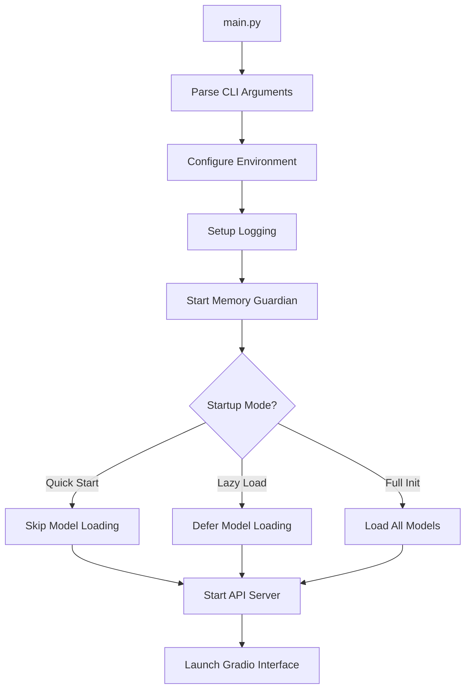

# Illustrious AI Studio - Developer Guide

## 📋 Overview

This guide provides developers with a comprehensive understanding of the Illustrious AI Studio codebase architecture, key components, and development workflows.

## 🏗️ Architecture Overview

The AI Studio follows a modular architecture with clear separation of concerns:

```text
├── 🎯 main.py              # Application entry point and orchestration
├── 🔌 app.py               # Compatibility wrapper and quick access APIs
├── 📁 core/                # Core functionality modules
├── 🖥️ ui/                  # Web interface components
├── 🌐 server/              # API server and MCP implementation
├── 🧪 tests/               # Comprehensive test suite
└── 📊 projects/            # User project workspaces
```

## 🔧 Key Components

### Core Modules (`core/`)

| Module | Purpose | Key Features |
|--------|---------|--------------|
| `config.py` | Configuration management | YAML config, env overrides, type safety |
| `state.py` | Application state container | Centralized state, thread-safe access |
| `sdxl.py` | SDXL image generation | Model loading, image generation, gallery |
| `ollama.py` | Language model integration | Chat, prompt generation, multimodal |
| `memory.py` | Memory management | GPU cleanup, status monitoring |
| `memory_guardian.py` | Memory monitoring | Real-time tracking, pressure management |

### User Interface (`ui/`)

- **`web.py`** - Complete Gradio-based web interface
  - Image generation with advanced controls
  - Interactive chat with conversation history
  - Gallery management and organization
  - Model switching and monitoring
  - Real-time memory statistics
  - Theme switching and preferences

### API Server (`server/`)

- **`api.py`** - FastAPI-based REST API
  - Image generation endpoints
  - Chat completion API
  - Model management
  - Health monitoring
  - MCP (Model Context Protocol) compliance

## 🚀 Application Startup Flow



## 🎛️ Configuration System

The configuration system supports multiple layers:

1. **Default Values** - Defined in `AppConfig` dataclass
2. **YAML File** - `config.yaml` overrides defaults
3. **Environment Variables** - Highest priority overrides

### Key Configuration Options

```yaml
# Model Configuration
sd_model: "models/Illustrious.safetensors"
ollama_model: "goekdenizguelmez/JOSIEFIED-Qwen3:8b-q6_k"
ollama_vision_model: "qwen2.5vl:7b"

# Performance Settings
gpu_backend: "cuda"  # cuda, rocm, mps, cpu
load_models_on_startup: true

# Memory Management
memory_guardian:
  profile: "balanced"  # conservative, balanced, aggressive
  thresholds:
    warning: 80
    critical: 90
```

## 🧠 State Management

The `AppState` class serves as the central state container:

```python
@dataclass
class AppState:
    # AI Model Instances
    sdxl_pipe: Optional[StableDiffusionXLPipeline] = None
    ollama_model: Optional[str] = None
    
    # Status Tracking
    model_status: Dict[str, bool] = field(default_factory=...)
    
    # User Data
    chat_history_store: Dict[str, List[Tuple[str, str]]] = field(default_factory=dict)
    latest_generated_image: Optional[Image.Image] = None
    current_project: Optional[str] = None
```

## 🔄 Development Workflows

### Adding New Features

1. **Core Logic** - Implement in appropriate `core/` module
2. **UI Integration** - Add interface components in `ui/web.py`
3. **API Endpoints** - Expose via `server/api.py` if needed
4. **Configuration** - Add settings to `core/config.py`
5. **Tests** - Create comprehensive tests in `tests/`

### Model Integration

To add support for new AI models:

1. Create new module in `core/` (e.g., `core/new_model.py`)
2. Implement initialization function following existing patterns
3. Update `AppState` to track model status
4. Add UI controls in appropriate tabs
5. Expose via API endpoints if needed

### Memory Management

The application includes sophisticated memory management:

- **Memory Guardian** - Real-time monitoring and cleanup
- **GPU Memory Cleanup** - Automatic cache clearing
- **Model Unloading** - Dynamic model management
- **Pressure Detection** - Automatic optimization triggers

## 🧪 Testing Strategy

The test suite covers:

- **Unit Tests** - Individual component testing
- **Integration Tests** - Component interaction verification
- **API Tests** - Endpoint functionality validation
- **Memory Tests** - Resource management verification
- **UI Tests** - Interface behavior validation

Run tests with:

```bash
python -m pytest tests/ -v
```

## 📝 Code Style and Standards

### Commenting Standards

All code follows comprehensive commenting standards:

- **Module Docstrings** - Purpose, features, architecture
- **Class Docstrings** - Responsibilities, attributes, usage
- **Function Docstrings** - Parameters, returns, side effects
- **Inline Comments** - Complex logic explanation
- **Section Headers** - Logical code organization

### Error Handling

- Graceful degradation when models unavailable
- Detailed error logging with context
- User-friendly error messages in UI
- Automatic recovery where possible

### Performance Considerations

- Lazy loading of heavy models
- Memory-efficient data structures
- GPU memory optimization
- Concurrent request handling
- Caching of expensive operations

## 🔍 Debugging and Troubleshooting

### Logging System

The application uses structured logging:

```python
# Configure logging level
--log-level DEBUG

# Log files location
logs/illustrious_ai_studio.log
```

### Common Issues

1. **Model Loading Failures**
   - Check model file paths and permissions
   - Verify GPU memory availability
   - Review configuration settings

2. **Memory Issues**
   - Monitor memory guardian output
   - Use `--optimize-memory` flag
   - Check GPU utilization

3. **API Connection Problems**
   - Verify Ollama server is running
   - Check network connectivity
   - Review API endpoint configuration

## 📚 Additional Resources

- **Configuration Reference** - `config.yaml` with all options
- **API Documentation** - Available at `/docs` when server running
- **Test Examples** - Comprehensive test suite in `tests/`
- **Usage Examples** - Sample scripts in `examples/`

## 🤝 Contributing

When contributing to the codebase:

1. Follow the established commenting standards
2. Add appropriate tests for new features
3. Update documentation as needed
4. Maintain backward compatibility
5. Consider performance implications

The comprehensive commenting system makes the codebase self-documenting and developer-friendly. Each module, class, and function includes detailed documentation explaining its purpose, usage, and integration points.
